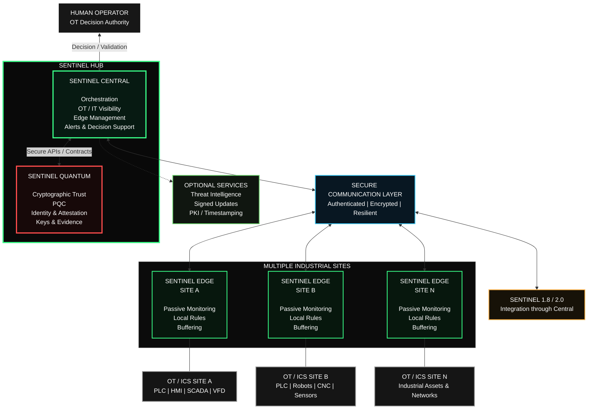

# Sentinel Architecture — Public Boundary

This diagram is intentionally high-level.

It describes the public authority and trust boundaries of the Sentinel ecosystem without exposing proprietary implementation details.

## Architecture principle

**Sentinel Central + Sentinel Quantum form the Sentinel HUB.**

The architecture deliberately separates:

- operational visibility;
- cryptographic trust;
- local Edge observation;
- human OT decision authority.

---

## Sentinel Central

Sentinel Central coordinates the operational side of the Sentinel ecosystem.

Its public responsibilities include:

- orchestration;
- Edge management;
- OT / IT visibility;
- policy distribution;
- alert aggregation;
- decision support;
- evidence coordination;
- integration with other Sentinel components.

Central is the main coordination point between the Sentinel HUB and distributed Sentinel Edge deployments.

---

## Sentinel Quantum

Sentinel Quantum is the cryptographic trust engine of the Sentinel ecosystem.

Its responsibilities include:

- identity validation;
- device and service attestations;
- post-quantum cryptography;
- cryptographic keys and certificates;
- trust-policy enforcement;
- evidence integrity;
- cryptographic guardrails;
- safe-local trust behavior when required.

Sentinel Quantum remains technically decoupled from Sentinel Central through defined APIs and contracts.

This separation allows the cryptographic trust layer to evolve independently from the operational OT layer.

---

## Sentinel Edge

Multiple Sentinel Edge stations can operate across separate industrial sites.

A Sentinel Edge deployment may provide:

- passive OT / IT observation;
- local visibility;
- local detection rules;
- local buffering;
- store-and-forward;
- continued observation during temporary communication loss.

Each Sentinel Edge reports its permitted observations, state and alerts to Sentinel Central.

---

## Industrial environments

Sentinel Edge is designed to observe industrial environments containing assets such as:

- PLCs;
- HMIs;
- SCADA systems;
- RTUs;
- DCS components;
- variable-frequency drives;
- industrial robots;
- CNC equipment;
- sensors;
- industrial network infrastructure.

The architecture is designed so Sentinel monitoring does not become part of the industrial control path.

---

## Secure communication layer

Communication between distributed Sentinel components is designed around:

- authentication;
- encryption;
- resilience;
- trust validation;
- controlled policy distribution.

The communication layer connects Sentinel Central with distributed Sentinel Edge deployments.

---

## Human-in-the-loop

Important OT remediation and operational decisions remain under human authority.

Sentinel Quantum may automatically enforce intrinsic cryptographic protections when trust cannot be established.

However, Quantum does **not** independently:

- stop a PLC;
- start a PLC;
- open or close a valve;
- modify PLC logic;
- change production setpoints;
- modify machine recipes;
- control an industrial process;
- replace the human operator.

The distinction is intentional:

> **Sentinel Central and Sentinel Edge understand the operational environment.**

> **Sentinel Quantum protects the cryptographic trust boundary.**

> **Human operators retain authority over significant OT decisions.**

---

## Sentinel 1.8 and Sentinel 2.0

Sentinel 1.8 and Sentinel 2.0 can integrate with the broader Sentinel ecosystem through Sentinel Central.

This allows them to access HUB services while keeping Sentinel Quantum technically separated from their operational logic.

---

## Optional external services

The architecture may interact with optional external services such as:

- threat intelligence;
- signed software updates;
- PKI services;
- trusted timestamping;
- backup or replication services.

These services are not required to define the internal authority boundary of the Sentinel HUB.

---

## Public disclosure boundary

This document intentionally describes only the high-level architecture.

It does **not** disclose:

- Sentinel source code;
- proprietary algorithms;
- internal detection logic;
- cryptographic secrets;
- private keys;
- internal policy implementation;
- sensitive test vectors;
- detailed attack paths;
- customer or production information.

---

**Shadow-Tech2030 Inc.**

*Passive & Secure by Design*

https://shadowtech2030.ca
