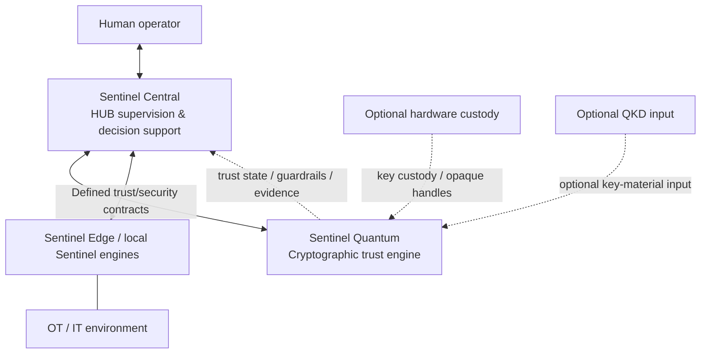

# Sentinel Quantum — Block 24 Public Architecture Boundary

## Public boundary

- Central provides supervision and decision support.
- Quantum provides cryptographic trust.
- Edge / local engines retain field context.
- Human operators retain authority over meaningful OT actions.

Quantum may deny a cryptographic operation when trust cannot be established.

Quantum does not directly control industrial processes.

SAFE_LOCAL preserves cryptographic guardrails when Central is unavailable.
