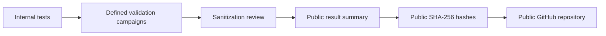

# Sentinel Quantum — Block 24 Public Validation Flow



## Block 24 public results

```text
Successive crypto transition campaign  -> 24/24 PASS
Central / Quantum / Edge E2E           -> 10/10 PASS
E2E failure campaign                   -> 14/14 PASS
Secure local continuity                -> VALIDATED
Crypto diversity slots                 -> READY
```

Only sanitized results are published.

Raw logs, source code, internal test vectors and confidential implementation detail remain private.
