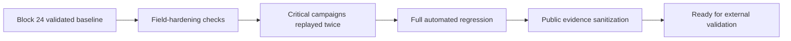

# Sentinel Quantum — Block 25 Public Validation Flow

This document describes the sanitized Block 25 readiness workflow.



## Critical campaigns replayed

```text
Successive Crypto Transition      PASS / PASS
Central / Quantum / Edge E2E      PASS / PASS
E2E Failure Campaign              PASS / PASS
Secure Local Continuity           PASS / PASS
Full regression                   1291 passed
```

## Validation rule

A Block 25 readiness result is considered PASS only when:

- all required critical campaigns pass;
- repeated runs remain stable;
- the full regression suite passes;
- the validation working tree is clean;
- the public summary contains no raw logs or secrets.

## Public evidence rule

Public output contains only sanitized results.

Source code, raw logs, credentials, private key material and proprietary implementation detail remain private.
