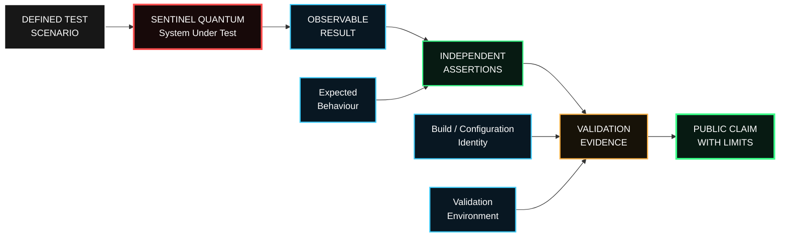

# Sentinel Quantum — Public Validation Flow

This document describes the public validation methodology used to support selected Sentinel Quantum security claims.

It intentionally excludes proprietary source code, internal test logic and sensitive implementation details.

## Validation principle

A capability is not considered demonstrated simply because it exists in software.

A publishable security claim should be supported by:

- a defined scenario;
- an expected behaviour;
- an observable result;
- a measurable success criterion;
- a measurable failure criterion;
- reproducible evidence;
- an explicit statement of limitations.

---

## Current public milestone

**838 automated tests passed — 0 failed**

This result represents the current internal automated software-validation baseline.

The validation suite covers areas including:

- cryptographic controls;
- fail-closed behaviour;
- anti-replay protections;
- post-quantum key establishment;
- compromise-recovery mechanisms;
- process hardening;
- software-supply-chain controls;
- authority boundaries;
- trust boundaries;
- evidence integrity;
- auditability;
- safe-local behaviour.

---

## Post-quantum validation

The current validation environment exercises:

- **ML-KEM-768**
- **ML-DSA-65**
- OpenSSL-backed cryptographic operations

These tests validate defined software behaviours within the current test environment.

They do not constitute hardware certification or independent cryptographic certification.

---

## Evidence model

Each validation result should be associated with enough context to understand what was tested.

Public evidence may include:

- validation snapshot version;
- build identifier;
- configuration identifier;
- timestamp;
- validation environment;
- expected behaviour;
- observed behaviour;
- success or failure status;
- evidence hash;
- limitation statement.

Sensitive internal implementation details remain private.

---

## Reproducibility

Where appropriate, a public validation claim should be reproducible at the level required to verify the claim.

Reproducibility does **not** require publication of proprietary source code.

Independent validation may instead rely on:

- black-box testing;
- defined interfaces;
- published expected behaviour;
- controlled test environments;
- independently captured observations;
- signed or hashed evidence artifacts.

---

## Failure criteria

A validation test should be capable of failing.

Examples include:

- accepting an invalid identity;
- accepting replayed cryptographic material;
- allowing an unauthorized cryptographic operation;
- silently downgrading a required trust level;
- producing unverifiable evidence;
- violating an authority boundary;
- failing to enter the expected safe state.

A security claim without a defined failure condition is not treated as meaningful validation.

---

## Validation limits

The current public validation milestone does **not** represent:

- independent certification;
- HSM certification;
- TPM certification;
- secure-element certification;
- physical tamper-resistance validation;
- side-channel resistance validation;
- proof against every possible attack;
- formal mathematical proof of the complete Sentinel ecosystem.

These areas require dedicated validation.

---

## Future validation stages

Planned validation stages include:

1. independent technical review;
2. hardware-backed cryptographic validation;
3. HSM or secure-element integration testing;
4. physical security evaluation;
5. side-channel evaluation;
6. Sentinel Central integration validation;
7. Sentinel Edge integration validation;
8. third-party or academic reproducibility testing where appropriate.

---

## Public validation rule

Shadow-Tech2030 follows a simple principle:

> **Evidence should support the claim.  
> The claim should never exceed the evidence.**

---

**Shadow-Tech2030 Inc.**

*Passive & Secure by Design*

https://shadowtech2030.ca
